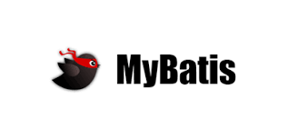
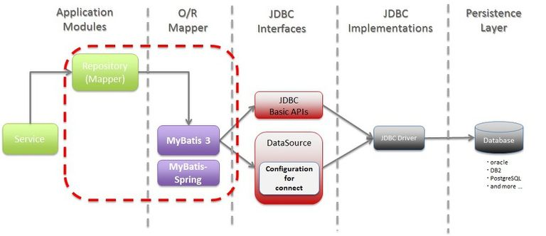

## JPA(Java Persistence API)

자바 ORM의 기술 표준, 대표적인 오픈 소스가 Hibernate이다.

**※ Persistence**

직역하면 지속성, 영속성이란 의미.

예를 들어 데이터 기록을 하는데 RAM은 휘발성이란 특성으로 인해 전력의 공급이 끊기면 데이터는 모두 사라진다.

그러나 하드디스크 같은 경우 갑작스러운 전력 공급의 차단에도 비휘발성이라는 특성으로 데이터는 영구히 저장되게 된다.

이렇게 **데이터가 영구히 저장이 되는 특성**을 영속성, persistence라고 생각하면 된다.

하지만 이때 Java를 사용하는 환경에서 하드디스크가 아닌 DBMS에 저장을 하는 것이다.

결국 JPA란, JAVA에서 데이터를 영구히 기록할 수 있는 환경을 제공하는 API 라고 생각하면 된다.

**JPA의 장점**

1. RDB의 종류에 상관없이 사용가능하다. 추후 DB변경이나 코드 재활용이 용이하다.

2. 기본적인 CRUD제공과 페이징 처리 등 상당 부분 구현되어 있어 비지니스 로직에 집중할 수 있다.

3. 테이블 생성, 변경 등 엔티티 관리가 간편하다.

4. 쿼리에 집중할 필요 없이 빠른 개발이 가능하다.

**JPA의 단점**

어렵다. (단방향, 양방향, 임베디드 관계 등 이해해야할 내용이 많으며, 연관관계 이해없이 잘못 코딩을 하게되면 성능상의 문제와 동작이 원하는대로 되지 않는 일이 발생한다.)

## ORM(Object-relational mapping)

**객체 관계 매핑, 객체와 RDB를 별개로 설계하고 OMR이 중간에서 매핑해주는 역할**

ORM은 SQL문이 아닌 RDB에 데이터 그 자체와 매핑하기 때문에 SQL을 직접 작성할 필요가 없다. 해당 객체와의 매핑에 필요한 SQL문을 알아서 만들어준다. 이로인해 어떤 RDB를 사용해도 상관없다. SQL이 아닌 ORM에서 제공하는 메서드, 코드 등을 이용해서 직관적이다.

## MyBatis

마이바티스는 개발자가 지정한 SQL, 저장프로시저 그리고 몇가지 고급 매핑을 지원하는 퍼시스턴스 프레임워크이다. 마이바티스는 JDBC로 처리하는 상당부분의 코드와 파라미터 설정 및 결과 매핑을 대신해준다. 마이바티스는 데이터베이스 레코드에 원시타입과 Map 인터페이스 그리고 자바 POJO를 설정해서 매핑하기 위해 XML과 어노테이션을 사용할 수 있다.

- MyBatis는 자바에서 SQL Mapper를 지원해주는 프레임워크이다.

- SQL작성을 직접하여 객체와 매핑해준다.

**MyBatis의 장점**

1. JPA의 비해 쉽다.

2. SQL의 세부적인 내용 변경 시 좀 더 간편하다.

3. 동적 쿼리 사용 시 JPA보다 간편하게 구현가능하다.
4. 

**MyBatis의 단점**

1. 데이터베이스 설정변경 시 수정할 부분이 많다. 

2. Mapper작성부터 인터페이스 설계까지 JPA보다 많은 설계와 파일, 로직이 필요하다.

3. 특정 DB에 종속적이다.

**MyBatis3의 Databases Access 구조**

### MyBatis ORM

MyBatis ORM은 데이터베이스 CRUD를 위한 JDBC 자바 코드의 반복적인 저수준의 작업들을 추상화 했다. JDBC 드라이버 로딩, RDBMS 연결, PreparedStatement, SQL Parameter Binding, ResultSet Iteration 그리고 Resource Clean-up 등의 반복적인 코드와 예외처리 그리고 트랜잭션 관리 등을 SqlSession 인터페이스 하나로 추상화 했다. 이 말은 SqlSession 인터페이스만 가지고 모든 작업이 가능하다는 말이다. Session의 의미는

1. 연결
2. 트랜잭션 시작
3. 쿼리 실행
4. 트랜잭션 종료
5. 연결 종료

와 같은 일련의 과정을 일컫는다. 그런데 인터페이스의 이름에 SQL이 아직 남아있다. 이는 MyBatis의 RDBMS 추상화 단계가 SQL까지 감추지 않았다는 의미다. MyBatis ORM에서는 객체를 저장하거나 로딩 또는 변경, 영구적 삭제 등을 위해 SQL를 직접 다루어야 한다. 하지만 SQL를 직접 다루는 자바 표준 기술인 JDBC을 사용하는 자바 코드만큼이나 반복적이거나 복잡하고 상투적이지 않다. 정리하면, MyBatis ORM은

1. SQL를 중심으로 SQL의 파라미터를 자바 객체와 매핑한다.
2. select SQL문의 결과(ResultSet)를 자바 객체와 매핑한다.

이 두 가지 매핑 작업은 Mapper라 불리는 것을 사용한다. Mapper의 사용은 기존의 직접적인 JDBC 자바 코드와 달리 선언적으로 이루어 진다. 그렇기 때문에 덜 복잡하고 직관적이며 SQL를 자바 코드에서 완벽하게 분리한다.

## 매핑(Mapping)

MyBatis는 SQL과 자바 객체와의 매핑에 주력한 ORM 기술로 SQL문의 파라미터와 Select의 결과(ResultSet)를 자바 객체에 매핑한다. 

이 매핑 도구를 Mapper라 부르고 XML 또는 Mapper Interface의 Annotation을 통해 가능하다.

이 두가지 방법에 따라 각각 XML Mpper 또는 Annotation Mapper라 부른다. 개인적으로 XML Mapper를 선호하는 편이지만 Annotation Mapper의 Mpapper Interface는 매핑 방법에 상관없이 매핑된 SQL문 실행에 많은 유연성을 제공하기 때문에 알아 두는 것이 좋다.

SQL문의 실행은 언급한 바, Mpapper Interface를 선호하지만 SqlSession 객체의 메소드 호출이 보다 일반적이라 볼 수 있다. 

**SQL Mapper**

SQL문을 이용하여 RDB에 접근, 데이터를 오브젝트(객체)화 시켜준다.

개발자가 작성한 SQL문으로 해당되는 ROW를 읽어 온 후 결과 값을 오브젝트화 시켜 사용가능하게 만들어준다.

즉, RDB에 따라 SQL 문법이 다르기 때문에 특정 RDB에 종속적이다.

