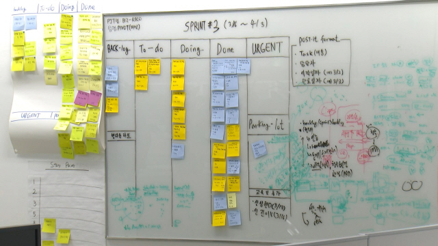

# Spring

## 4.1 어플리케이션 아키텍처


1. **3계층은 스프링을 사용하는 엔터프라이즈 애플리케이션에서 가장 많이 사용되는 구조**

2. **스프링 주요 모듈과 기술을 보면 3계층 구조에 맞게 설계**

3. **논리적 개념이므로 언제든지 상황과 조건에 따라 달라 질 수 있다.**


### 애플리케이션 아키텍처 예제


## 애자일 소프트웨어 개발 (Agile software development) 

**애자일** 방법론은 소프트웨어 개발 방법에 있어서 아무런 계획이 없는 개발 방법과 계획이 지나치게 많은 개발 방법들 사이에서 타협점을 찾고자 하는 방법론이다. 

다른 고전적인 방법론, 예를 들면 폭포수 모델 또는 나선 모형과 구별되는 가장 큰 차이점은 less document-oriented, 즉 문서를 통한 개발 방법이 아니라, code-oriented, 실질적인 코딩을 통한 방법론이라는 점이다.


애자일 개발 프로세스로 불리는 개발 방법론에는 다음과 같은 것들이 있다.

- **익스트림 프로그래밍(Extreme Programming, XP)** - 애자일 개발 프로세스의 대표자로 애자일 개발 프로세스의 보급에 큰 역할을 하였다. 이 방법은 고객과 함께 2주 정도의 반복개발을 하고, 테스트우선 개발(TDD)을 특징으로 하는 명시적인 기술과 방법을 가지고 있다.

- **스크럼** - 30일마다 동작 가능한 제품을 제공하는 스프린트(Sprint)를 중심으로 하고 있다. 매일 정해진 시간에 정해진 장소에서 짧은시간의 개발을 하는 팀을 위한, 프로젝트 관리 중심의 방법론이다.

- **크리스털 패밀리**- 이 방식은 프로젝트의 규모와 영향의 크기에 따라서 여러종류의 방법론을 제공한다. 그중에서 가장 소규모 팀에 적용하는 **크리스털 클리어**는 익스트림 프로그래밍 만큼 엄격하지도 않고 효율도 높지 않지만, 프로젝트에 적용하기 쉬운 방법론이다.

- **Feature-Driven Development** - feature마다 2주정도의 반복 개발을 실시한다. Peter Coad가 제창하는 방법론으로써, UML을 이용한 설계 기법과도 밀접한 관련을 가진다.

- **ASD(Adaptive Software Development)** - 소프트웨어 개발을 혼란 자체로 규정하고, 혼란을 대전제로 그에 적응할 수 있는 소프트웨어 방법을 제시하기 위해 만들어진 방법론이다. 내용적으로는 다른 방법론들과 유사하지만, 합동 애플리케이션 개발(Joint Application Development, 사용자나 고객이 설계에 참가하는 개발 방법론)을 사용하고 있는 것이 조금 다르다.

- **익스트림 모델링** - 익스트림 모델링은 UML을 이용한 모델링 중심 방법론이다. 다만, 여타 모델링 방법들과는 달리, 언제나 실행할 수 있고 검증할 수 있는 모델을 작성하는 공정을 반복해서, 최종적으로는 모델로부터 자동적으로 제품을 생성하게 한다.

상기 소개된 애자일 개발 프로세스들은 각자 다른 특징과 적용 범위가 있으며, 서로 조합도 가능하다. 애자일 개발 프로세스를 채용하고 있는 프로젝트에서는 특정 방법론만을 채택해서 매뉴얼대로 흉내만 내는 것이 아니라, 여러 방법중에서 자신의 프로젝트에 맞는 부분을 취사 선택하여 조합하고, 또 독자적인 방법을 만들어 냄으로써 큰 효과를 올리고 있다. 이러한 애자일 개발 프로세스의 제창자들은 애자일 연합이라는 자유로운 조직을 만들고, 애자일 개발 프로세스의 보급에 힘쓰고 있다.


**예) KT의 스크럼보드**




### DeFaultServlet위임

**스프링 동작 과정중**

- 서버로 클라이언트의 요청이 들어오면 web.xml에 지정된 servlet-mapping을 확인해서 Dispatcher 실행 
- Dispatcher Servlet(Controller)가 init( ) 함수 호출되게 되는데 이때 DefaultServlet를 추가하지 않으면 정적 자원(html, css, js 등)에 접근실패한다.

==> DispatcherServlet 이 모든 URL처리에 서블릿 매핑을 하였기 때문에 톰캣은 정적 자원에 대한 URL처리도 DispatcherServlet에게 넘기기 때문이다.


spring-servlet.xml에 삽입

```
	<!-- validator, conversionService, messageConverter를 자동으로 등록 -->
	<mvc:annotation-driven />
	<!-- 서블릿 컨테이너(tomcat)의 DefaultServlet 위임(Delegate) Handler -->
	<mvc:default-servlet-handler/>
```

을 통해  DefaultServlet 위임(Delegate) Handler를 추가가능하다.


#### viewResolver 설정

ViewResolver는 HandlerMapping이 컨트롤러를 찾아주는 것 처럼, View 이름을 가지고 View 오브젝트를 찾아준다.


spring-servlet.xml에 삽입

	<!-– ViewResolver 설정 !-->
	<bean id=＂viewResolver＂ class=＂org.springframework.web.servlet.view.InternalResourceViewResolver＂>
	    <property name=＂viewClass" value="org.springframework.web.servlet.view.JstlView" />
	    <property name="prefix" value="/WEB-INF/views/" />
	    <property name="suffix" value=".jsp" />
	    <property name="order" value="1" />
	    // order프로퍼티를 지정해 ViewResolver의 우선순위를 지정할수 있다.
	</bean>

"/WEB-INF/views/main/index.jsp" -> "main/index"

view resolver 설정으로 "main/index"만 작성가능


## 예외 처리

### Checked Exception & Runtime Exception

예외에는 두가지로 나뉜다

- Checked Exception

- Runtime Exception

  Runtime Exception 밑에는 Unchecked Exception이 있다


#### Checked Exception

지정해준 예외 처리 클래스가 있는 Exception이므로 try catch로 감싸준다


#### RuntimeException

처리할 예외 클래스가 없기 때문에 error이다

try catch 나 throw Exception을 강제하지 않는다

예외처리를 해도되고 안해도된다

처리를 할 때는 한곳에 받아서 AOP를 이용해 처리를 해준다

이 경우엔 어노테이션으로 @ControllerAdvice 를 쓰면된다


#### 예외 처리 회피

메소드 선언부분에서 메소드()  throws를 쓰게되면 예외 회피이다

예외가 발생하면 예외를 외부로 던진다 -> 해당 메소드를 호출한 곳으로!
